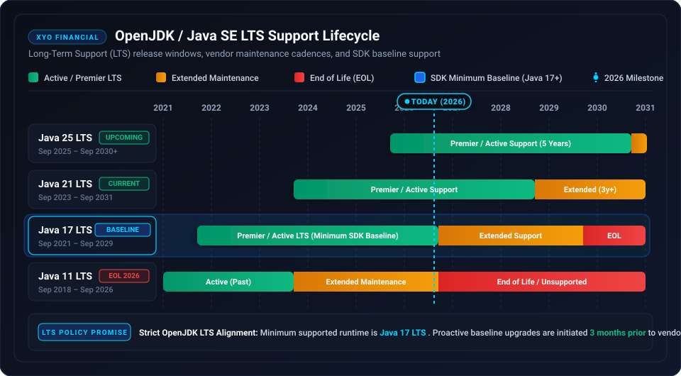

# 🛡️ Security Policy

## 📋 Supported SDK Versions

Only the `2.0.0` release of the XYO Java SDK receives active security updates and patches.

| Version | Supported | Status |
| ------- | --------- | ------ |
| 2.0.0   | :white_check_mark: | Active GA |
| < 2.0.0 | :x: | End of Life (Unsupported) |

---

## ⚙️ Runtime Lifecycle & OpenJDK LTS Support Policy

XYO Financial strictly adheres to the OpenJDK LTS cadence. We guarantee support for the minimum supported LTS version (currently Java 17 LTS) and proactively update our baseline and release upgrades 3 months before an active LTS baseline reaches end of premier support.

### 📊 Java SE & OpenJDK LTS Compatibility Matrix

| Java Version | LTS Release Date | Premier Support End | Extended Support End | SDK Support Status | Recommendation & Policy |
| ------------ | ---------------- | ------------------- | -------------------- | ------------------ | ----------------------- |
| **Java 25 LTS** | September 2025 | September 2030 | September 2033+ | 🟢 Supported (Next LTS) | Fully tested and supported upon GA release. Target runtime for forward-compatible architectures. |
| **Java 21 LTS** | September 2023 | September 2028 | September 2031 | 🟢 Supported (Recommended) | **Recommended runtime**. Optimized for virtual threads (Project Loom) and modern JVM performance. |
| **Java 17 LTS** | September 2021 | September 2026 | September 2029 | 🟡 Minimum Supported Baseline | **Minimum required JDK/JRE**. Upgrade to Java 21 LTS recommended prior to vendor Premier Support EOL. |
| **Java 11 LTS** | September 2018 | September 2023 | September 2026 | 🔴 Unsupported in v2.x | Deprecated. Reached end of Premier Support. Not supported by XYO Java SDK v2.0.0+. |
| **Java 8 & earlier (<= 8)** | March 2014 | March 2019 | December 2030 (Vendor) | 🔴 Unsupported | Legacy runtime. Strictly incompatible with modern XYO Java SDK bytecode baseline (Java 17 bytecode). |

### 🔒 Proactive Lifecycle Transition Process

1. **Continuous Compatibility Testing:** All CI/CD test pipelines validate builds against Java 17, Java 21, and upcoming OpenJDK early-access builds.
2. **3-Month Advance Notice:** Whenever a minimum baseline LTS reaches Premier Support EOL, XYO Financial will issue deprecation notices 3 months in advance and advance the SDK baseline in the subsequent major or minor release.
3. **Security Patch Delivery:** Security patches and critical CVE remediations are tested and verified across all active LTS versions within our guaranteed SLA.

---

## 🚨 Reporting a Vulnerability

If you discover a potential security vulnerability in this SDK, please do not report it publicly through a GitHub issue. Instead, report it privately:

- **Email:** security@syniol.com
- **Response Time:** We will acknowledge receipt of your vulnerability report within 48 hours and provide a detailed response on next steps within 5 business days.
